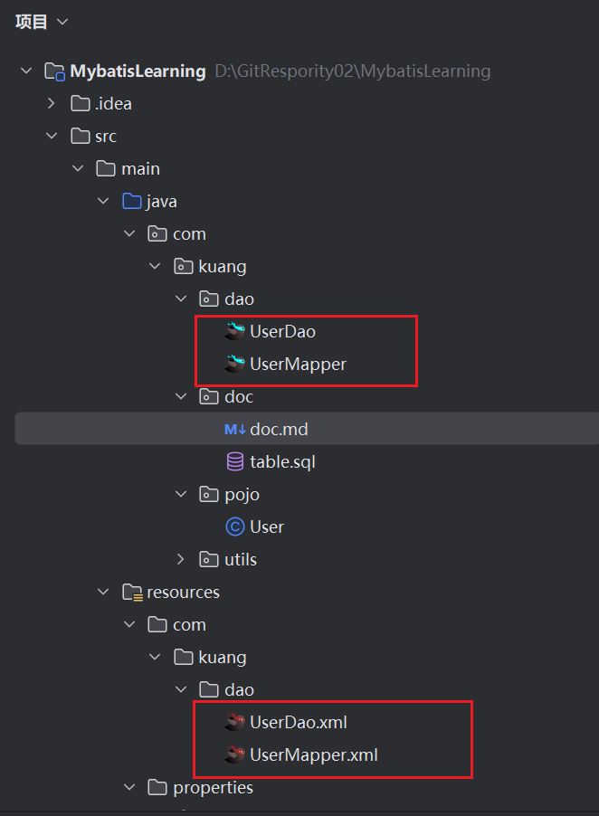
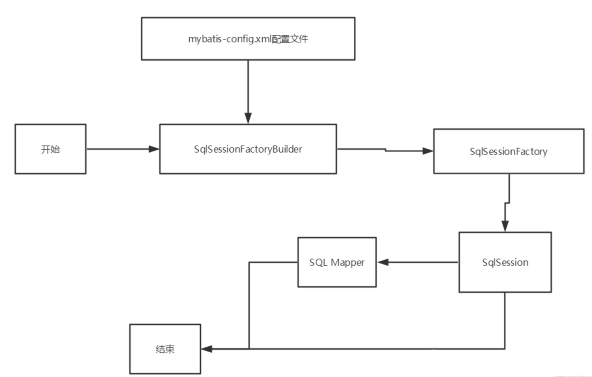
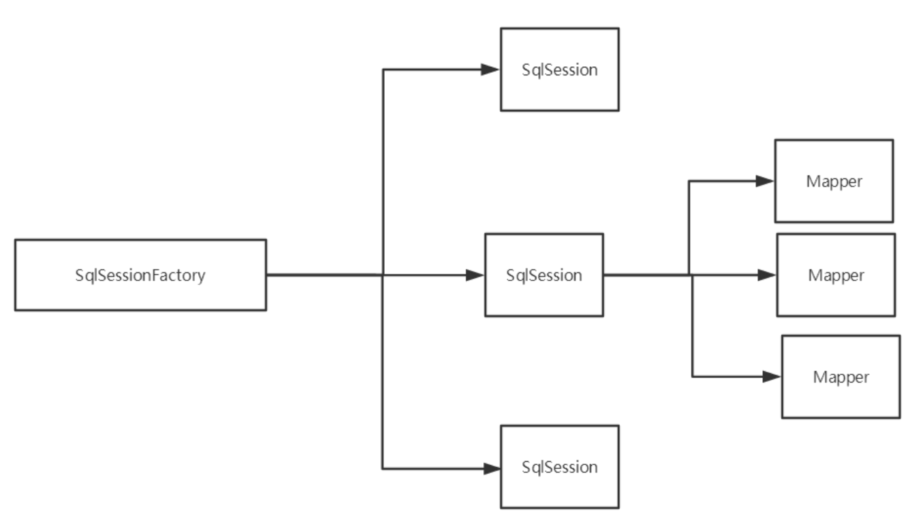
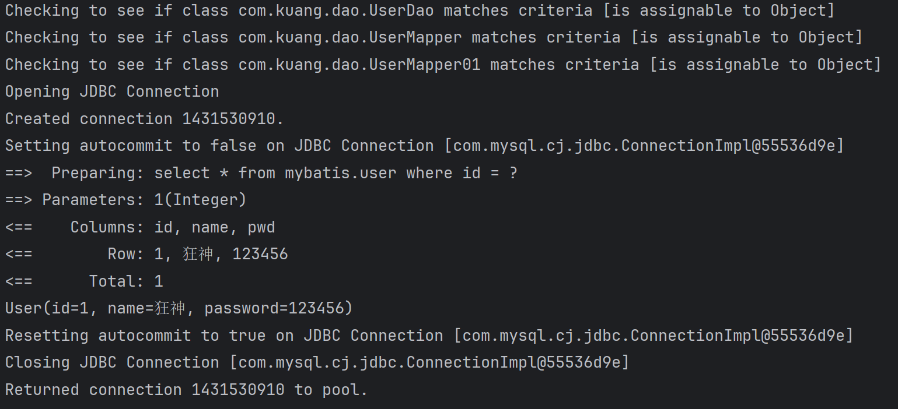
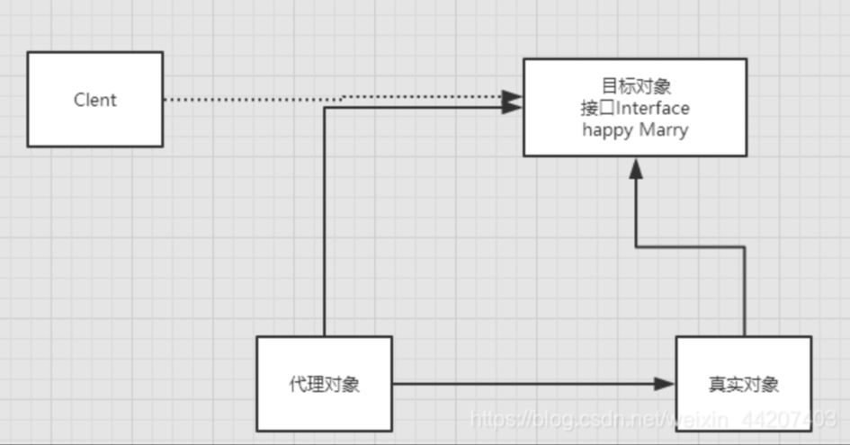
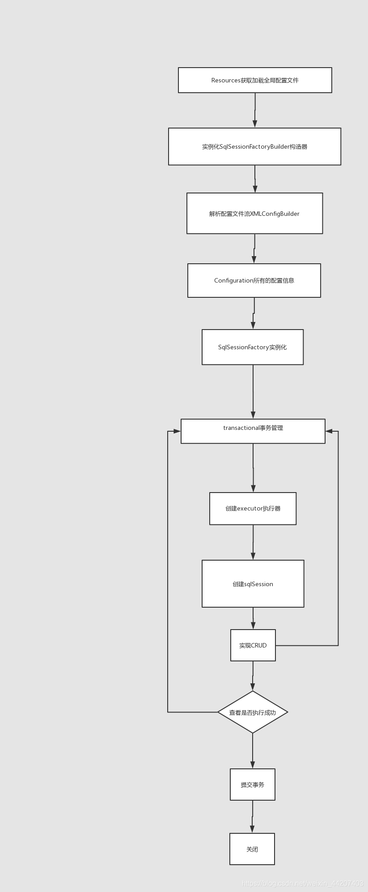

# 参考文章


[MyBatis-全面详解（学习总结）](https://blog.csdn.net/weixin_44207403/article/details/106735755)

[mybatis看这一篇就够了，简单全面一发入魂](https://blog.csdn.net/vcj1009784814/article/details/106391982)

[Mybatis动态SQL（详细介绍）](https://blog.csdn.net/m0_74777020/article/details/132323477)

[【MyBatis】如何使用“动态SQL”（超详解）](https://blog.csdn.net/weixin_44825912/article/details/130433302)

[Mybatis中的缓存机制（一文带你弄懂）](https://blog.csdn.net/qq_51917627/article/details/132528306?)

# 导入maven依赖

```xml
<dependencies>
        <dependency>
            <groupId>mysql</groupId>
            <artifactId>mysql-connector-java</artifactId>
            <version>8.0.33</version>
        </dependency>
        <dependency>
            <groupId>org.mybatis</groupId>
            <artifactId>mybatis</artifactId>
            <version>3.4.6</version>
        </dependency>
        <dependency>
            <groupId>org.projectlombok</groupId>
            <artifactId>lombok</artifactId>
            <version>1.18.12</version>
            <scope>provided</scope>
        </dependency>
        <dependency>
            <groupId>junit</groupId>
            <artifactId>junit</artifactId>
            <version>4.10</version>
            <scope>test</scope>
        </dependency>
    </dependencies>
```


# 核心配置文件
- mybatis-config.xml

- MyBatis 的配置文件包含了会深深影响 MyBatis 行为的设置和属性信息。

```
configuration（配置）
properties（属性）
settings（设置）
typeAliases（类型别名）
typeHandlers（类型处理器）
objectFactory（对象工厂）
plugins（插件）
environments（环境配置）
environment（环境变量）
transactionManager（事务管理器）
dataSource（数据源）
databaseIdProvider（数据库厂商标识）
mappers（映射器）

```

# 类型别名（typeAliases）

- 类型别名是为 Java 类型设置一个短的名字。
- 存在的意义仅在于用来减少类完全限定名的冗余。

```xml
    <!--可以给实体类起别名-->
    <typeAliases>
        <typeAlias type="com.kuang.pojo.User" alias="User"/>
    </typeAliases>

```

也可以指定一个包名，MyBatis 会在包名下面搜索需要的 Java Bean，比如：

扫描实体类的包，它的默认别名就为这个类的 类名，首字母小写！

```xml
<!--可以给实体类起别名-->
<typeAliases>
    <package name="com.kuang.pojo"/>
</typeAliases>

```

在实体类比较少的时候，使用第一种方式。

如果实体类十分多，建议使用第二种。

第一种可以DIY别名，第二种则·不行·，如果非要改，需要在实体上增加注解

```java
@Alias("user")
public class User {}

```

# 映射器（mappers）
MapperRegistry：注册绑定我们的Mapper文件；

方式一： 【推荐使用】

```xml
<!--每一个Mapper.XML都需要在Mybatis核心配置文件中注册！-->
<mappers>
    <mapper resource="com/kuang/dao/UserMapper.xml"/>
</mappers>

```

方式二：使用class文件绑定注册

```xml
<!--每一个Mapper.XML都需要在Mybatis核心配置文件中注册！-->
<mappers>
    <mapper class="com.kuang.dao.UserMapper"/>
</mappers>

```

注意点：

- 接口和他的Mapper配置文件必须同名！
- 接口和他的Mapper配置文件必须在同一个包下！


方式三：使用扫描包进行注入绑定

```xml
<!--每一个Mapper.XML都需要在Mybatis核心配置文件中注册！-->
<mappers>
    <package name="com.kuang.dao"/>
</mappers>

```

注意点：

- 接口和他的Mapper配置文件必须同名！
- 接口和他的Mapper配置文件必须在同一个包下！

其实我发现，好像不在同一个包下也行！大概下面这样的结构:



# 生命周期和作用域




生命周期，和作用域，是至关重要的，因为错误的使用会导致非常严重的**并发问题**。

## SqlSessionFactoryBuilder：

- 一旦创建了 SqlSessionFactory，就不再需要它了
- 局部变量


## SqlSessionFactory：

- 说白了就是可以想象为 ：数据库连接池
- SqlSessionFactory 一旦被创建就应该在应用的运行期间一直存在，**没有任何理由丢弃它或重新创建另一个实例。**
- 因此 SqlSessionFactory 的最佳作用域是应用作用域。
- 最简单的就是使用**单例模式**或者静态单例模式。

## SqlSession

- 连接到连接池的一个请求！
- SqlSession 的实例不是线程安全的，因此是不能被共享的，所以它的最佳的作用域是请求或方法作用域。
- 用完之后需要赶紧关闭，否则资源被占用！



这里面的每一个Mapper，就代表一个具体的业务！


# 解决属性名和字段名不一致的问题

example:MyTest01 getUserByIdAlias

## 起别名

```xml
<select id="getUserById" resultType="com.kuang.pojo.User">
    select id,name,pwd as password from mybatis.user where id = #{id}
</select>

```

### resultMap 结果集映射

```xml
<!--结果集映射-->
<resultMap id="UserMap" type="User">
    <!--column数据库中的字段，property实体类中的属性-->
    <result column="id" property="id"/>
    <result column="name" property="name"/>
    <result column="pwd" property="password"/>
</resultMap>

<select id="getUserById" resultMap="UserMap">
    select * from mybatis.user where id = #{id}
</select>

```

- `resultMap` 元素是 MyBatis 中最重要最强大的元素
- ResultMap 的设计思想是，对于简单的语句根本不需要配置显式的结果映射，而对于复杂一点的语句只需要描述它们的关系就行了。
- `ResultMap` 最优秀的地方在于，虽然你已经对它相当了解了，但是根本就不需要显式地用到他们。
- 如果世界总是这么简单就好了。

# 日志

- SLF4J

- LOG4J 【掌握】

- LOG4J2

- JDK_LOGGING

- COMMONS_LOGGING

- STDOUT_LOGGING 【掌握】

- NO_LOGGING

在Mybatis中具体使用哪一个日志实现，在设置中设定！

**STDOUT_LOGGING标准日志输出**

在mybatis核心配置文件中，配置我们的日志！

```xml
<settings>
    <setting name="logImpl" value="STDOUT_LOGGING"/>
</settings>

```




# Log4j

## 什么是Log4j？

- Log4j是Apache的一个开源项目，通过使用Log4j，我们可以控制日志信息输送的目的地是控制台、文件、GUI组件
- 我们也可以控制每一条日志的输出格式；
- 通过定义每一条日志信息的级别，我们能够更加细致地控制日志的生成过程。
- 通过一个配置文件来灵活地进行配置，而不需要修改应用的代码。

## 1.先导入log4j的包

```xml
<!-- https://mvnrepository.com/artifact/log4j/log4j -->
<dependency>
    <groupId>log4j</groupId>
    <artifactId>log4j</artifactId>
    <version>1.2.17</version>
</dependency>

```

## 2.log4j.properties

这个properties要直接放在resources文件夹中

```properties
#将等级为DEBUG的日志信息输出到console和file这两个目的地，console和file的定义在下面的代码
log4j.rootLogger=DEBUG,console,file

#控制台输出的相关设置
log4j.appender.console = org.apache.log4j.ConsoleAppender
log4j.appender.console.Target = System.out
log4j.appender.console.Threshold=DEBUG
log4j.appender.console.layout = org.apache.log4j.PatternLayout
log4j.appender.console.layout.ConversionPattern=[%c]-%m%n

#文件输出的相关设置
log4j.appender.file = org.apache.log4j.RollingFileAppender
log4j.appender.file.File=./log/kuang.log
log4j.appender.file.MaxFileSize=10mb
log4j.appender.file.Threshold=DEBUG
log4j.appender.file.layout=org.apache.log4j.PatternLayout
log4j.appender.file.layout.ConversionPattern=[%p][%d{yy-MM-dd}][%c]%m%n

#日志输出级别
log4j.logger.org.mybatis=DEBUG
log4j.logger.java.sql=DEBUG
log4j.logger.java.sql.Statement=DEBUG
log4j.logger.java.sql.ResultSet=DEBUG
log4j.logger.java.sql.PreparedStatement=DEBUG

```

## 3.配置log4j为日志的实现

```xml
    <settings>
        <setting name="logImpl" value="LOG4J"/>
    </settings>
```


## 4.使用Log4j

example:Log4j的简单使用  MyTest01 testLog4j

### 1.在要使用Log4j 的类中，导入包 import org.apache.log4j.Logger;


### 2.日志对象，参数为当前类的class

```java
static Logger logger = Logger.getLogger(UserDaoTest.class);


```

### 3.日志级别

```java

logger.info("info:进入了testLog4j");
logger.debug("debug:进入了testLog4j");
logger.error("error:进入了testLog4j");

```


# 分页

## 思考：为什么要分页？

- 减少数据的处理量


## 使用Limit分页

```sql
语法：SELECT * from user limit startIndex,pageSize;
SELECT * from user limit 3;  #[0,n]


```

使用Mybatis实现分页，核心SQL

example:MyTest01 getUserByLimit


## RowBounds分页

不再使用SQL实现分页

example: MyTest01 getUserByRowBounds


## 分页插件: PageHelper

了解即可，万一 以后公司的架构师，说要使用，你需要知道它是什么东西！


# 使用注解开发

## 1.注解在接口上实现

```java

@Select("select * from user")
List<User> getUsers();

```


## 2.需要再核心配置文件中绑定接口！
```xml
<!--绑定接口-->
<mappers>
    <mapper class="com.kuang.dao.UserMapper"/>
</mappers>

```

example: MyTest02 getUsers 

本质：反射机制实现

底层：动态代理！



Mybatis详细的执行流程！




## CRUD

我们可以在工具类创建的时候实现自动提交事务！

```java
public static SqlSession  getSqlSession(){
    return sqlSessionFactory.openSession(true);
}

```

编写接口，增加注解


```java
public interface UserMapper {

    @Select("select * from user")
    List<User> getUsers();

    // 方法存在多个参数，所有的参数前面必须加上 @Param("id")注解
    @Select("select * from user where id = #{id}")
    User getUserByID(@Param("id") int id);


    @Insert("insert into user(id,name,pwd) values (#{id},#{name},#{password})")
    int addUser(User user);

    
    @Update("update user set name=#{name},pwd=#{password} where id = #{id}")
    int updateUser(User user);

    
    @Delete("delete from user where id = #{uid}")
    int deleteUser(@Param("uid") int id);
}


```


测试类

【注意：我们必须要讲接口注册绑定到我们的核心配置文件中！】

### 关于@Param() 注解


- 基本类型的参数或者String类型，需要加上
- 引用类型不需要加
- 如果只有一个基本类型的话，可以忽略，但是建议大家都加上！
- 我们在SQL中引用的就是我们这里的 @Param() 中设定的属性名！


# Lombok

```
@Getter and @Setter
@FieldNameConstants
@ToString
@EqualsAndHashCode
@AllArgsConstructor, @RequiredArgsConstructor and @NoArgsConstructor
@Log, @Log4j, @Log4j2, @Slf4j, @XSlf4j, @CommonsLog, @JBossLog, @Flogger
@Data
@Builder
@Singular
@Delegate
@Value
@Accessors
@Wither
@SneakyThrows
```

这些注解主要来自 Java 的 Lombok 库，它简化了 Java 代码中的样板代码。以下是每个注解的解释：

### Lombok 注解

1. **`@Getter` 和 `@Setter`**:
    - 自动生成所有字段的 getter 和 setter 方法。使用这些注解，可以减少手动编写访问器方法的需要。

2. **`@FieldNameConstants`**:
    - 自动生成常量，以便在代码中使用字段名称。这对于避免硬编码字符串很有帮助。

3. **`@ToString`**:
    - 自动生成 `toString()` 方法，方便打印对象的信息。可以指定要包含或排除的字段。

4. **`@EqualsAndHashCode`**:
    - 自动生成 `equals()` 和 `hashCode()` 方法。这通常用于比较对象的内容和在集合中使用。

5. **`@AllArgsConstructor`**:
    - 自动生成一个包含所有字段的构造函数。

6. **`@RequiredArgsConstructor`**:
    - 自动生成一个构造函数，仅包含 `final` 字段和带有 `@NonNull` 注解的字段。

7. **`@NoArgsConstructor`**:
    - 自动生成一个无参构造函数。

### 日志注解

8. **`@Log`, `@Log4j`, `@Log4j2`, `@Slf4j`, `@XSlf4j`, `@CommonsLog`, `@JBossLog`, `@Flogger`**:
    - 这些注解用于生成日志对象。选择不同的日志框架（如 Log4j、SLF4J等）来自动创建日志实例，简化日志记录的实现。

### 其他注解

9. **`@Data`**:
    - 是一个组合注解，包含了 `@Getter`, `@Setter`, `@ToString`, `@EqualsAndHashCode`, 和 `@RequiredArgsConstructor`。使用这个注解可以快速生成常用的功能。

10. **`@Builder`**:
    - 自动生成构建者模式的实现，允许通过链式调用来创建对象。

11. **`@Singular`**:
    - 与 `@Builder` 一起使用，允许在构建集合类型（如 List、Set、Map）时添加单个元素。

12. **`@Delegate`**:
    - 使某个字段的方法可以直接被调用，而不需要通过该字段访问。例如，调用一个委托对象的方法。

13. **`@Value`**:
    - 生成一个不可变类的定义，通常用于数据传输对象（DTO）。默认情况下，字段是 `private` 和 `final` 的，并自动生成 `toString()`, `equals()`, `hashCode()` 和构造函数。

14. **`@Accessors`**:
    - 自定义 getter 和 setter 方法的命名风格，例如可以将方法名改为 `getName()` 和 `setName()` 为 `name()` 和 `name(...)`。

15. **`@Wither`**:
    - 生成一个 `with` 方法，用于创建字段值的副本，适用于不可变对象。

16. **`@SneakyThrows`**:
    - 允许在方法中抛出检查异常，而无需在方法签名中声明。这对于简化异常处理很有用。

### 总结
这些注解极大地减少了 Java 类中的样板代码，使代码更简洁、可读性更高，方便开发者快速实现常用功能。使用 Lombok 注解可以提高开发效率，减少错误。


`@RequiredArgsConstructor` 是 Lombok 提供的一个注解，用于自动生成一个构造函数。这个构造函数包含所有 **`final`** 字段和所有标记为 **`@NonNull`** 的字段。下面是更详细的解释：

### 关键点

1. **生成构造函数**：
    - 使用 `@RequiredArgsConstructor` 时，Lombok 会生成一个构造函数，该构造函数会接收所有 `final` 字段和所有被注解为 `@NonNull` 的字段作为参数。

2. **适用场景**：
    - 当你希望确保某些字段在对象创建时必需提供时，使用这个注解非常有用。这可以保证在构造对象时，这些字段不会是 `null`，从而增强了代码的安全性。

3. **示例**：

```java
import lombok.RequiredArgsConstructor;

@RequiredArgsConstructor
public class User {
    private final String username; // final 字段
    private final String password; // final 字段
    private String email; // 非 final 字段

    // 自动生成的构造函数：
    // public User(String username, String password) {
    //     this.username = username;
    //     this.password = password;
    // }
}
```

在上面的例子中，Lombok 会生成一个构造函数，接受 `username` 和 `password` 作为参数，因为这两个字段是 `final`。`email` 字段则不会包含在构造函数中，因为它不是 `final`。

### 总结

`@RequiredArgsConstructor` 注解使得类的设计更简洁，同时确保对象创建时必要字段的初始化。它帮助开发者避免编写冗长的构造函数，并提高了代码的可读性和安全性。


使用 `@Data` 注解时，Lombok 会自动生成一些常用方法，包括：

- 所有字段的 getter 和 setter 方法
- `toString()` 方法
- `equals()` 和 `hashCode()` 方法
- 一个包含所有字段的构造函数（如果字段没有 `final` 修饰符）

在你的 `Student` 类中

```java
@Data
public class Student {

    private int id;
    private String name;
    private int tid;

}

```


Lombok 会生成以下方法：

1. **Getters**:
    - `public int getId()`
    - `public String getName()`
    - `public int getTid()`

2. **Setters**:
    - `public void setId(int id)`
    - `public void setName(String name)`
    - `public void setTid(int tid)`

3. **`toString()` 方法**:
    - `public String toString()`

4. **`equals()` 和 `hashCode()` 方法**:
    - `public boolean equals(Object o)`
    - `public int hashCode()`

5. **构造函数**:
    - 因为没有使用 `final` 字段，Lombok 不会生成任何带参数的构造函数。只会生成一个无参构造函数。

### 总结
在这种情况下，使用 `@Data` 不会生成带参数的构造函数，只有默认的无参构造函数。要生成包含所有字段的构造函数，可以使用 `@AllArgsConstructor`，如下所示：

```java
import lombok.AllArgsConstructor;
import lombok.Data;

@Data
@AllArgsConstructor
public class Student {
    private int id;
    private String name;
    private int tid;
}
```

这样就会生成一个带有 `id`, `name`, 和 `tid` 参数的构造函数。


# 多对一处理

比如:多个学生，对应一个老师
对于学生来说，就是多对一关系

Student

```java
@Data
public class Student {

    private int id;
    private String name;
    private Teacher teacher;


}
```

Teacher
```java
@Data
public class Teacher {
    private int id;
    private String name;


}
```

## 按照查询嵌套处理

```xml
<!--
    思路:
        1. 查询所有的学生信息
        2. 根据查询出来的学生的tid，寻找对应的老师！  子查询
    -->

<select id="getStudent" resultMap="StudentTeacher">
    select * from student
</select>

<resultMap id="StudentTeacher" type="Student">
    <result property="id" column="id"/>
    <result property="name" column="name"/>
    <!--复杂的属性，我们需要单独处理 对象： association 集合： collection -->
    <association property="teacher" column="tid" javaType="Teacher" select="getTeacher"/>
</resultMap>

<select id="getTeacher" resultType="Teacher">
    select * from teacher where id = #{id}
</select>


```

## 按照结果嵌套处理

```xml
<!--按照结果嵌套处理-->
<select id="getStudent2" resultMap="StudentTeacher2">
    select s.id sid,s.name sname,t.name tname
    from student s,teacher t
    where s.tid = t.id;
</select>

<resultMap id="StudentTeacher2" type="Student">
    <result property="id" column="sid"/>
    <result property="name" column="sname"/>
    <association property="teacher" javaType="Teacher">
        <result property="name" column="tname"/>
    </association>
</resultMap>

```

example: MyTest02 getStudent

# 一对多处理

比如：一个老师拥有多个学生！

对于老师而言，就是一对多的关系!

Student

```java
@Data
public class Student {

    private int id;
    private String name;

    private int tid;

}

```

Teacher
```java
@Data
public class Teacher {
    private int id;
    private String name;

//    一个老师拥有多个学生
    private List<Student> students;
}

```

## 按照结果嵌套处理

```xml
    <!--按结果嵌套查询-->
    <select id="getTeacher" resultMap="TeacherStudent">
        select s.id sid, s.name sname, t.name tname,t.id tid
        from student s,teacher t
        where s.tid = t.id and t.id = #{tid}
    </select>

    <resultMap id="TeacherStudent" type="Teacher">
        <result property="id" column="tid"/>
        <result property="name" column="tname"/>
        <!--复杂的属性，我们需要单独处理 对象： association 集合： collection
        javaType="" 指定属性的类型！
        集合中的泛型信息，我们使用ofType获取
        -->
        <collection property="students" ofType="Student">
            <result property="id" column="sid"/>
            <result property="name" column="sname"/>
            <result property="tid" column="tid"/>
        </collection>
    </resultMap>

```


## 按照查询嵌套处理

```xml
<select id="getTeacher2" resultMap="TeacherStudent2">
    select * from mybatis.teacher where id = #{tid}
</select>

<resultMap id="TeacherStudent2" type="Teacher">
    <collection property="students" javaType="ArrayList" ofType="Student" select="getStudentByTeacherId" column="id"/>
</resultMap>

<select id="getStudentByTeacherId" resultType="Student">
    select * from mybatis.student where tid = #{tid}
</select>

```

example: MyTest03 getTeacher


## 小结
1.关联 - association 【多对一】
2.集合 - collection 【一对多】
3.javaType & ofType
- JavaType 用来指定实体类中属性的类型
- ofType 用来指定映射到List或者集合中的 pojo类型，泛型中的约束类型！


### 注意点：

- 保证SQL的可读性，尽量保证通俗易懂
- 注意一对多和多对一中，属性名和字段的问题！
- 如果问题不好排查错误，可以使用日志 ， 建议使用 Log4j


# select *注意事项

在MyBatis中，使用select *和直接指定列名在结果映射上通常应该是等效的，只要数据库表列和实体类属性之间的映射是正确配置的。但实际上，使用select *时，确实可能会遇到一些问题，尤其是在字段名称和Java实体属性名不完全匹配的情况下。


当使用select *时，数据库返回的字段名称需要与<resultMap>或resultType中定义的属性名称完全匹配。如果不匹配，MyBatis不会报错，而是默默地留下null。通过指定每个列并使用as来重命名（如create_time as createTime），可以确保数据库字段和Java实体类属性之间的正确对应。

另外，比如我们定义好resultMap

```xml
    <resultMap id="blog" type="com.kuang.pojo.Blog">
        <!--column数据库中的字段，property实体类中的属性-->
        <result column="id" property="id"/>
        <result column="title" property="title"/>
        <result column="author" property="author"/>
        <result column="create_time" property="createTime"/>
        <result column="views" property="views"/>
    </resultMap>
```

那要注意xml文件写成这样:

```xml
<!--    if-->
    <select id="queryBlogIF" parameterType="map" resultMap="blog">
        select * from mybatis.blog where 1=1
        <if test="title != null">
            and title = #{title}
        </if>
        <if test="author != null">
            and author = #{author}
        </if>
    </select>
```

不要写成这样:

```xml
<!--    if-->
    <select id="queryBlogIF" parameterType="map" resultType="blog">
        select * from mybatis.blog where 1=1
        <if test="title != null">
            and title = #{title}
        </if>
        <if test="author != null">
            and author = #{author}
        </if>
    </select>
```

不然查询出来的Blog中，createTime为null

原因就是这句话:
`当使用select *时，数据库返回的字段名称需要与<resultMap>或resultType中定义的属性名称完全匹配。如果不匹配，MyBatis不会报错，而是默默地留下null。通过指定每个列并使用as来重命名（如create_time as createTime），可以确保数据库字段和Java实体类属性之间的正确对应。`


# 动态sql

参考文章:

[Mybatis动态SQL（详细介绍）](https://blog.csdn.net/m0_74777020/article/details/132323477)

[【MyBatis】如何使用“动态SQL”（超详解）](https://blog.csdn.net/weixin_44825912/article/details/130433302)


example: MyTest04


# 缓存

参考文章:

[Mybatis中的缓存机制（一文带你弄懂）](https://blog.csdn.net/qq_51917627/article/details/132528306?)

example: 
- MyTest05 一级缓存
- MyTest06 二级缓存
- MyTest07 MyBatis集成EhCache

