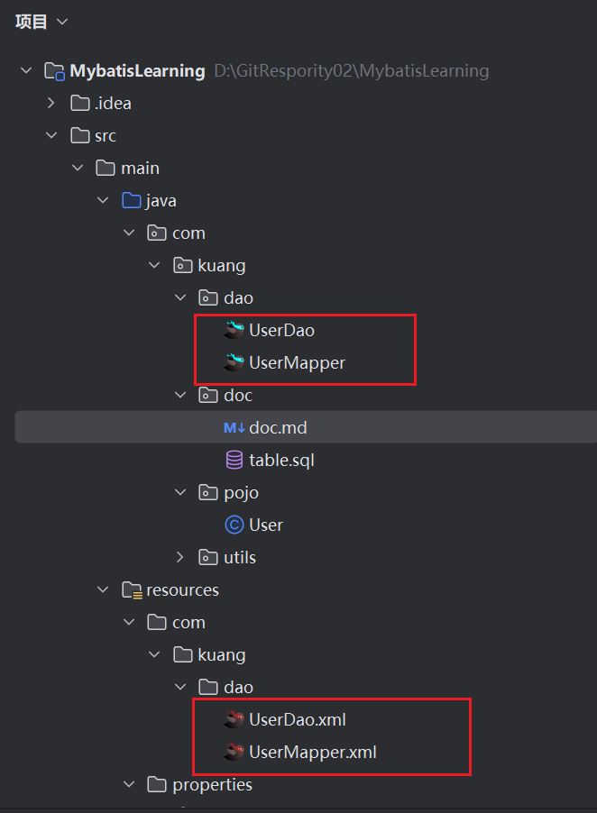
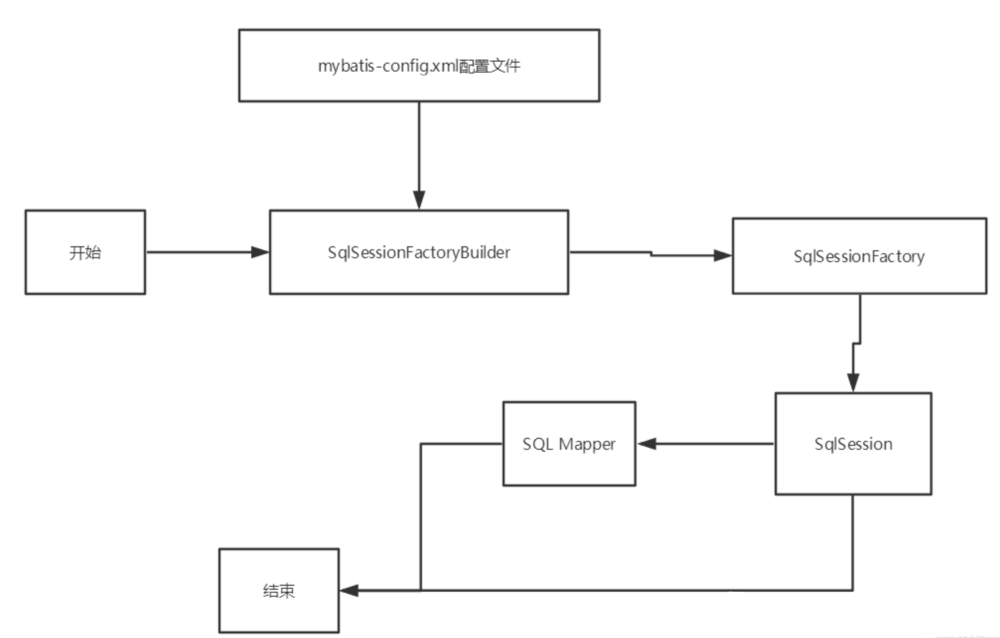
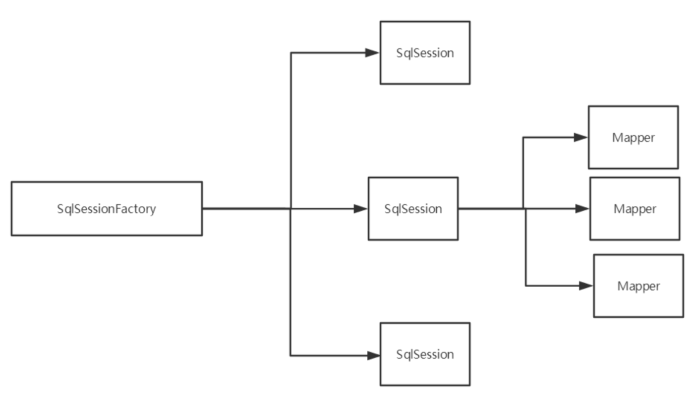
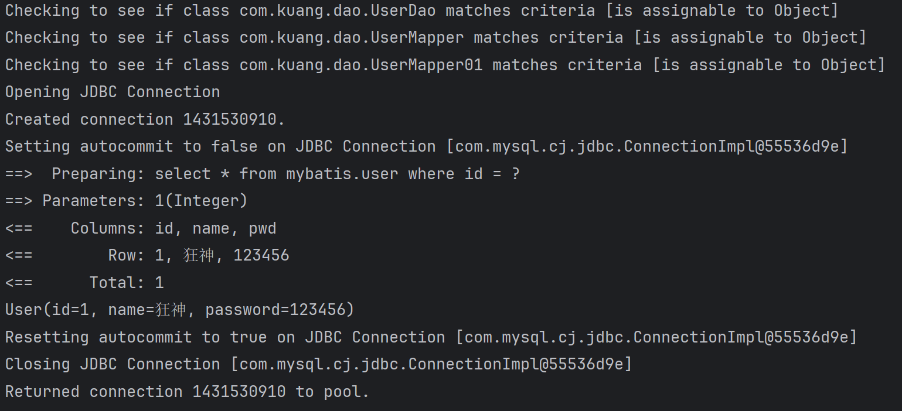

# 导入maven依赖

```xml
<dependencies>
        <dependency>
            <groupId>mysql</groupId>
            <artifactId>mysql-connector-java</artifactId>
            <version>8.0.33</version>
        </dependency>
        <dependency>
            <groupId>org.mybatis</groupId>
            <artifactId>mybatis</artifactId>
            <version>3.4.6</version>
        </dependency>
        <dependency>
            <groupId>org.projectlombok</groupId>
            <artifactId>lombok</artifactId>
            <version>1.18.12</version>
            <scope>provided</scope>
        </dependency>
        <dependency>
            <groupId>junit</groupId>
            <artifactId>junit</artifactId>
            <version>4.10</version>
            <scope>test</scope>
        </dependency>
    </dependencies>
```


# 核心配置文件
- mybatis-config.xml

- MyBatis 的配置文件包含了会深深影响 MyBatis 行为的设置和属性信息。

```
configuration（配置）
properties（属性）
settings（设置）
typeAliases（类型别名）
typeHandlers（类型处理器）
objectFactory（对象工厂）
plugins（插件）
environments（环境配置）
environment（环境变量）
transactionManager（事务管理器）
dataSource（数据源）
databaseIdProvider（数据库厂商标识）
mappers（映射器）

```

# 类型别名（typeAliases）

- 类型别名是为 Java 类型设置一个短的名字。
- 存在的意义仅在于用来减少类完全限定名的冗余。

```xml
    <!--可以给实体类起别名-->
    <typeAliases>
        <typeAlias type="com.kuang.pojo.User" alias="User"/>
    </typeAliases>

```

也可以指定一个包名，MyBatis 会在包名下面搜索需要的 Java Bean，比如：

扫描实体类的包，它的默认别名就为这个类的 类名，首字母小写！

```xml
<!--可以给实体类起别名-->
<typeAliases>
    <package name="com.kuang.pojo"/>
</typeAliases>

```

在实体类比较少的时候，使用第一种方式。

如果实体类十分多，建议使用第二种。

第一种可以DIY别名，第二种则·不行·，如果非要改，需要在实体上增加注解

```java
@Alias("user")
public class User {}

```

# 映射器（mappers）
MapperRegistry：注册绑定我们的Mapper文件；

方式一： 【推荐使用】

```xml
<!--每一个Mapper.XML都需要在Mybatis核心配置文件中注册！-->
<mappers>
    <mapper resource="com/kuang/dao/UserMapper.xml"/>
</mappers>

```

方式二：使用class文件绑定注册

```xml
<!--每一个Mapper.XML都需要在Mybatis核心配置文件中注册！-->
<mappers>
    <mapper class="com.kuang.dao.UserMapper"/>
</mappers>

```

注意点：

- 接口和他的Mapper配置文件必须同名！
- 接口和他的Mapper配置文件必须在同一个包下！


方式三：使用扫描包进行注入绑定

```xml
<!--每一个Mapper.XML都需要在Mybatis核心配置文件中注册！-->
<mappers>
    <package name="com.kuang.dao"/>
</mappers>

```

注意点：

- 接口和他的Mapper配置文件必须同名！
- 接口和他的Mapper配置文件必须在同一个包下！

其实我发现，好像不在同一个包下也行！大概下面这样的结构:



# 生命周期和作用域




生命周期，和作用域，是至关重要的，因为错误的使用会导致非常严重的**并发问题**。

## SqlSessionFactoryBuilder：

- 一旦创建了 SqlSessionFactory，就不再需要它了
- 局部变量


## SqlSessionFactory：

- 说白了就是可以想象为 ：数据库连接池
- SqlSessionFactory 一旦被创建就应该在应用的运行期间一直存在，**没有任何理由丢弃它或重新创建另一个实例。**
- 因此 SqlSessionFactory 的最佳作用域是应用作用域。
- 最简单的就是使用**单例模式**或者静态单例模式。

## SqlSession

- 连接到连接池的一个请求！
- SqlSession 的实例不是线程安全的，因此是不能被共享的，所以它的最佳的作用域是请求或方法作用域。
- 用完之后需要赶紧关闭，否则资源被占用！



这里面的每一个Mapper，就代表一个具体的业务！


# 解决属性名和字段名不一致的问题

example:MyTest01 getUserByIdAlias

## 起别名

```xml
<select id="getUserById" resultType="com.kuang.pojo.User">
    select id,name,pwd as password from mybatis.user where id = #{id}
</select>

```

### resultMap 结果集映射

```xml
<!--结果集映射-->
<resultMap id="UserMap" type="User">
    <!--column数据库中的字段，property实体类中的属性-->
    <result column="id" property="id"/>
    <result column="name" property="name"/>
    <result column="pwd" property="password"/>
</resultMap>

<select id="getUserById" resultMap="UserMap">
    select * from mybatis.user where id = #{id}
</select>

```

- `resultMap` 元素是 MyBatis 中最重要最强大的元素
- ResultMap 的设计思想是，对于简单的语句根本不需要配置显式的结果映射，而对于复杂一点的语句只需要描述它们的关系就行了。
- `ResultMap` 最优秀的地方在于，虽然你已经对它相当了解了，但是根本就不需要显式地用到他们。
- 如果世界总是这么简单就好了。

# 日志

- SLF4J

- LOG4J 【掌握】

- LOG4J2

- JDK_LOGGING

- COMMONS_LOGGING

- STDOUT_LOGGING 【掌握】

- NO_LOGGING

在Mybatis中具体使用哪一个日志实现，在设置中设定！

**STDOUT_LOGGING标准日志输出**

在mybatis核心配置文件中，配置我们的日志！

```xml
<settings>
    <setting name="logImpl" value="STDOUT_LOGGING"/>
</settings>

```




# Log4j

## 什么是Log4j？

- Log4j是Apache的一个开源项目，通过使用Log4j，我们可以控制日志信息输送的目的地是控制台、文件、GUI组件
- 我们也可以控制每一条日志的输出格式；
- 通过定义每一条日志信息的级别，我们能够更加细致地控制日志的生成过程。
- 通过一个配置文件来灵活地进行配置，而不需要修改应用的代码。

## 1.先导入log4j的包

```xml
<!-- https://mvnrepository.com/artifact/log4j/log4j -->
<dependency>
    <groupId>log4j</groupId>
    <artifactId>log4j</artifactId>
    <version>1.2.17</version>
</dependency>

```

## 2.log4j.properties

这个properties要直接放在resources文件夹中

```properties
#将等级为DEBUG的日志信息输出到console和file这两个目的地，console和file的定义在下面的代码
log4j.rootLogger=DEBUG,console,file

#控制台输出的相关设置
log4j.appender.console = org.apache.log4j.ConsoleAppender
log4j.appender.console.Target = System.out
log4j.appender.console.Threshold=DEBUG
log4j.appender.console.layout = org.apache.log4j.PatternLayout
log4j.appender.console.layout.ConversionPattern=[%c]-%m%n

#文件输出的相关设置
log4j.appender.file = org.apache.log4j.RollingFileAppender
log4j.appender.file.File=./log/kuang.log
log4j.appender.file.MaxFileSize=10mb
log4j.appender.file.Threshold=DEBUG
log4j.appender.file.layout=org.apache.log4j.PatternLayout
log4j.appender.file.layout.ConversionPattern=[%p][%d{yy-MM-dd}][%c]%m%n

#日志输出级别
log4j.logger.org.mybatis=DEBUG
log4j.logger.java.sql=DEBUG
log4j.logger.java.sql.Statement=DEBUG
log4j.logger.java.sql.ResultSet=DEBUG
log4j.logger.java.sql.PreparedStatement=DEBUG

```

## 3.配置log4j为日志的实现

```xml
    <settings>
        <setting name="logImpl" value="LOG4J"/>
    </settings>
```


## 4.使用Log4j

example:Log4j的简单使用  MyTest01 testLog4j

### 1.在要使用Log4j 的类中，导入包 import org.apache.log4j.Logger;


### 2.日志对象，参数为当前类的class

```java
static Logger logger = Logger.getLogger(UserDaoTest.class);


```

### 3.日志级别

```java

logger.info("info:进入了testLog4j");
logger.debug("debug:进入了testLog4j");
logger.error("error:进入了testLog4j");

```


